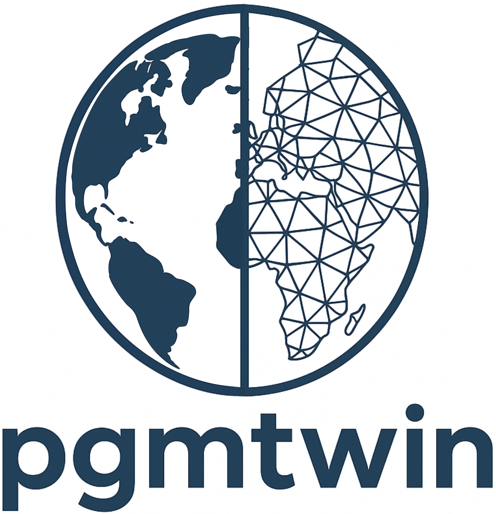
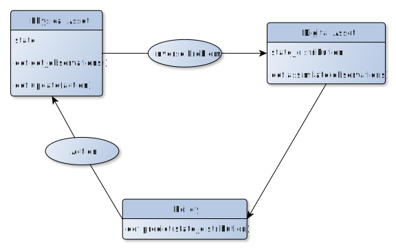
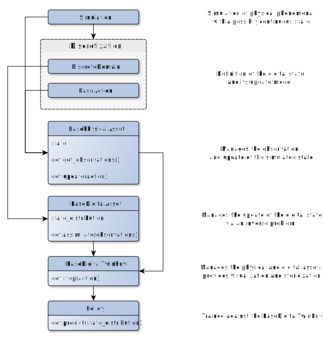
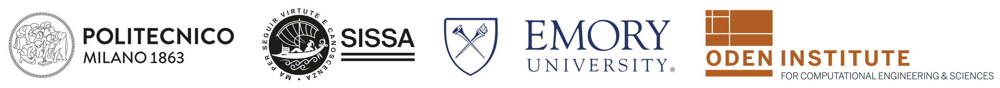

<p align="center">
  <a href="https://github.com/lfabris-mhpc/pgmtwin" target="_blank" >
    
  </a>
</p>

**pgmtwin** is a Python library for building, simulating, and analyzing digital twins (DTs) using probabilistic graphical models (PGMs). It provides modular components for defining environments, assets, actions, and policies, supporting both deterministic and stochastic systems.

### Features

- Modular digital twin framework
- Integration of PGMs for state estimation and uncertainty propagation
- Compatible with standard reinforcement learning (RL) libraries (e.g., gymnasium and stable-baselines3)
- Support for discrete domains
- Extensible for custom domains, simulators, actions, and control policies
- Basic structural health monitoring (SHM) example
- Basic robot pathing example

## Installation

It is suggested to install via pip
```bash
pip install git+https://github.com/pgmtwin/pgmtwin
```
Some examples depend on fenicsx, which is currently only available through conda  
To setup an editable installation, use:
```bash
git clone https://github.com/pgmtwin/pgmtwin
cd pgmtwin
conda env create -n pgmtwin -f env_pgmtwin.yml
pip install -e .[examples]
```
To install all optional dependencies, including the support for tests and documentation, specify 'full'

## Basic Usage
A digital twin typically consists of several core components:
- **Physical Asset:** The real or simulated system being monitored or controlled.
- **Digital Asset:** The virtual representation of the physical asset, including models for inference and prediction.
- **Policy:** The logic or algorithm that decides which actions to take based on the digital asset's state.
- **Actions:** The set of possible interventions or controls that can be applied to the physical asset.

<!--  -->
<p align="center">

</p>
<p align="center">
<em>The structure of a generic Digital Twin.</em>
</p>

To use `pgmtwin`, you generally follow these steps:
1. **Provide the simulation for the physical asset:** Specify the state for the simulation and the effects of the possible actions
2. **Set up actions and a discrete domain:** Create the set of actions and the domain for the state maintained by the digital asset.
3. **Assemble the digital twin:** Combine the components into a digital twin environment.
4. **Simulate or analyze:** Run simulations, perform inference, or train policies as needed.

The diagram below illustrates the typical workflow and component interactions in `pgmtwin`:

<!--  -->
<p align="center">

</p>
<p align="center">
<em>The components of pgmtwin.</em>
</p>

## Capabilities

- Define custom physical and digital assets, environments and policies leveraging modular and clean interfaces
- Assemble Digital Twin models for simulation and analysis
- Employ Probabilistic Graphical Models during assimilation for enhanced accuracy
- Compatible with stable-baselines3 for training policies
- Leverage the specialized modules to bootstrap the development of new applications

## API Reference

See the [documentation](https://pgmtwin.github.io/pgmtwin/) for detailed API reference.

## Tutorials & Examples

The tutorials directory contains notebooks designed to familiarize the user with the classes and patterns used throughout the library.  
The users will be shown how to 
- wrap their own simulators, inverse problem solvers and policy algorithm
- how to design a new Probabilistic Graphical Model to enhance the assimilation of observations


## Contributing

Contributions are welcome! Please open issues or pull requests for bug fixes, new features, or documentation improvements.

## Funding
A significant part of pgmtwin has been written either as a by-product for other projects people were funded for, or by people on university-funded positions. There are probably many of such projects that have led to some development of pgmtwin. We are very grateful for this support!

Beyond this, pgmtwin has also been supported by some dedicated projects that have allowed us to work on extensions, documentation, training and dissemination that would otherwise not have been possible. In particular, we acknowledge the seminal work done at the Oden Institute for Computational Engineering and Sciences and the following sources of support with great gratitude:

* Ph.D. grant “Physics-informed deep learning for structural health monitoring” supported by the Politecnico di Milano.
* Ph.D. grant PNRR DM117/2023 at SISSA mathLab with Fincantieri S.p.A.

<p align="center">
    
</p>

## License

This project is licensed under the MIT License.
